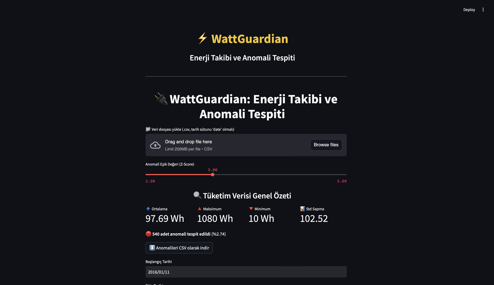
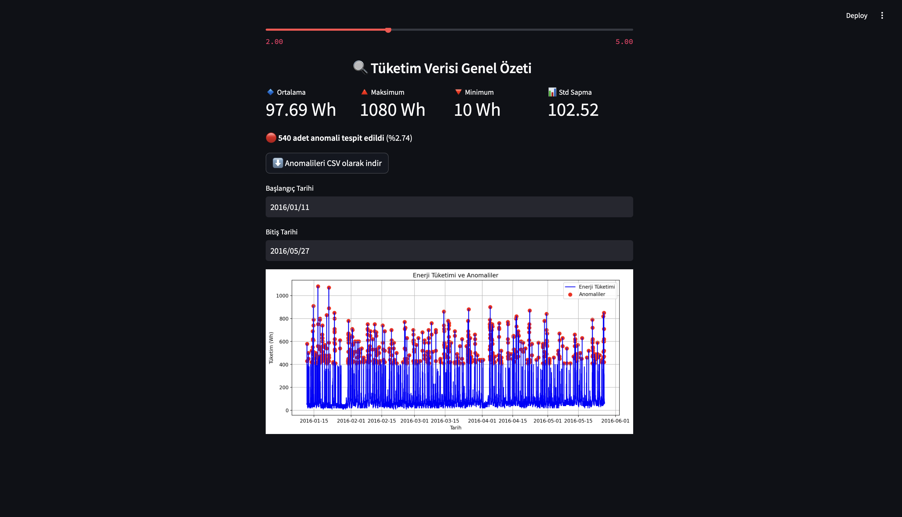

⚡️ WattGuardian: Smart Energy Monitoring System

WattGuardian is a dual-purpose AI-powered tool for both **real-time anomaly detection** and **energy consumption forecasting**, now enhanced with a stylish **interactive Streamlit web interface** for seamless exploration and analysis.

---

🚀 Project Overview

WattGuardian provides two core functionalities:

1. 🔍 Anomaly Detection with Autoencoder + Z-Score
   - Detects unusual spikes or drops in appliance energy usage.
   - Web app allows dynamic Z-score threshold tuning for precision control.

2. 🔮 Energy Consumption Forecasting with LSTM
   - Forecasts future energy consumption trends using an LSTM-based time-series model.

3. 🖥️ Streamlit Web Interface (NEW)
   - 📁 Upload your own `.csv` file or use the default dataset
   - 🎚️ Choose anomaly detection threshold interactively
   - 📆 Select time ranges
   - 📈 Visualize anomalies with dynamic plots
   - ⬇️ Download detected anomalies as CSV
   - 🌙 Enjoy modern dark-themed styling with custom CSS

 📷 **Streamlit UI Preview**

Main Interface:


Anomaly Detection in Action:

---

 📊 Visual Results

 🔍 Anomaly Detection  


🔮 Energy Forecasting  


---

🧠 Technologies Used

- Python 3
- Pandas, NumPy
- Scikit-learn
- TensorFlow / Keras
- Streamlit
- Matplotlib

---

📁 Dataset

- Source: UCI Machine Learning Repository  
- Dataset: [`energydata_complete.csv`](https://archive.ics.uci.edu/ml/machine-learning-databases/00374/energydata_complete.csv)  
- Description: Hourly energy usage from appliances and lights in a smart home environment.

---

🛠️ How to Run

```bash
1. Clone the repository
git clone https://github.com/bermaldemirtass/WattGuardian.git
cd WattGuardian

2. Install dependencies
pip install -r requirements.txt

3. Run backend scripts (if needed)
python main.py

 4. Launch the Streamlit app
streamlit run app.py

---

📬 Contact

Made with ❤️ by [Bermal Demirtaş](mailto: demirtasbermal@icloud.com)  
Feel free to reach out for collaboration or feedback!

