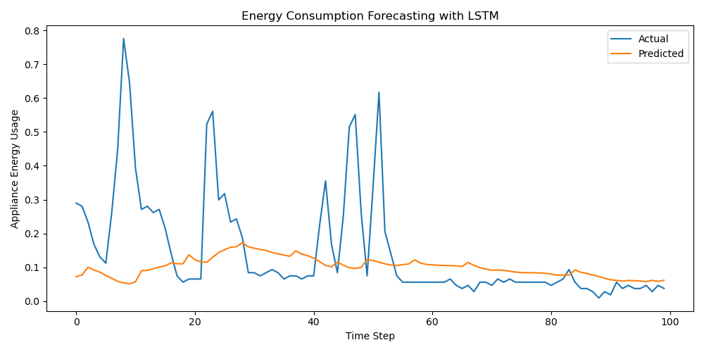

⚡️ WattGuardian: Smart Energy Monitoring System

WattGuardian is a dual-purpose AI project focused on **real-time anomaly detection** and **energy consumption forecasting** for smart grid and IoT-based systems.

---

🚀 Project Overview

WattGuardian provides two key features:

1. 🔍 Anomaly Detection with Autoencoder
   Detects unusual spikes or drops in appliance energy usage using an unsupervised deep autoencoder model.

2. 🔮 Energy Consumption Forecasting with LSTM
   Predicts future energy consumption trends using a time-series LSTM model trained on past energy data.

📊 Visual Results

🔍 Anomaly Detection

 🔮 Energy Forecasting

🧠 Technologies Used

- Python
- Pandas, NumPy
- Scikit-learn
- TensorFlow / Keras
- Matplotlib, Seaborn

📁 Dataset

- Source: UCI Machine Learning Repository  
- Dataset: [`energydata_complete.csv`](https://archive.ics.uci.edu/ml/machine-learning-databases/00374/energydata_complete.csv)  
- Description: Hourly energy usage from appliances and lights in a smart home.

🛠️ How to Run

``bash
 1. Clone this repo
git clone https://github.com/bermaldemirtass/WattGuardian.git
cd WattGuardian

 2. Install dependencies
pip install -r requirements.txt

 3. Run the project
python main.py

